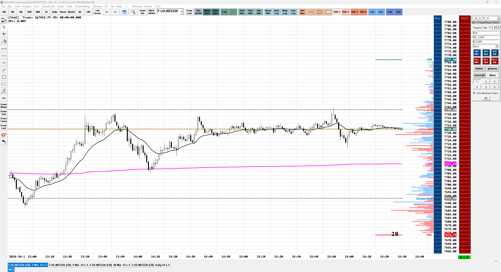
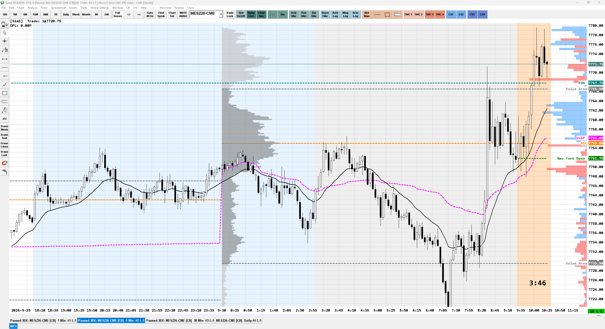
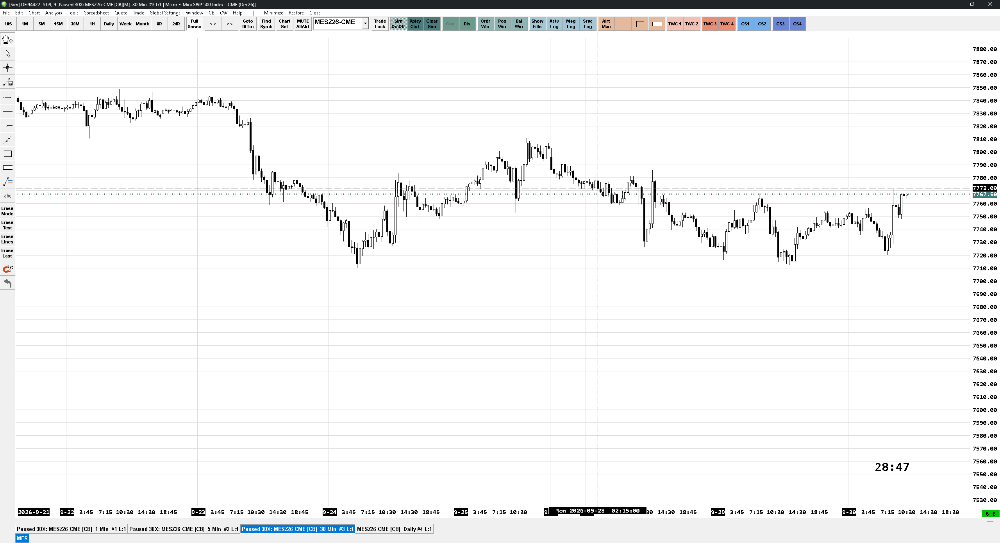
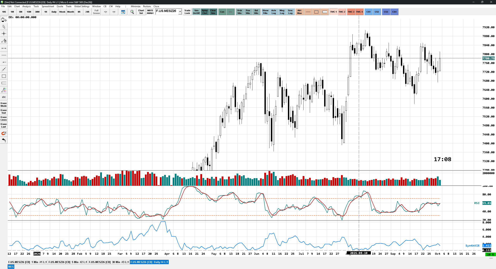
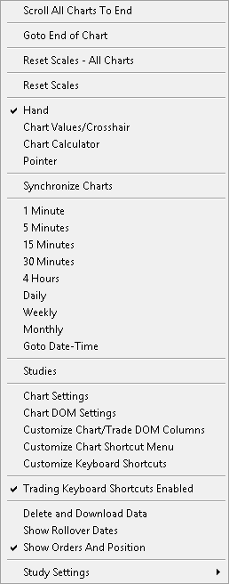

# Free Sierra Chart Template for MES

> *Setting this up from scratch is a total pain in the ass. I really wish I had this ready-made template back then!*

## Included Files & Installation

### `Sierra4.config`
Contains the Sierra Chart settings including the Control Bars.

**Installation:** Copy the file into your main **Sierra Chart** folder.

> **Note:** This file is optional. If removed, Sierra Chart will automatically recreate it with the default settings.

### `MES.cht`
The chartbook containing the prepared MES charts.

---

## Quick Tips

- The **1-minute and 5-minute charts use the same studies**.
- **Volume Profile and Delta settings** can be adjusted to your personal preference.
- **8R / 24R** are Range Bar charts and can be interesting for exploring different trading ideas or styles.
- **DD** shows the current market data delay for reference.
- **Session times are intentionally rounded**, so small overlaps or gaps between sessions are possible.
- The **TWC button** can be linked to Order Templates.
- **CS / ACS buttons** can be assigned to additional functions.
- Additional **drawing tools with alerts** are available next to the Alert Manager.
- The **Status Bar** has been removed from the Control Bar because the relevant information is already shown in the application title bar.

---

## Chart Previews

### 1-Minute Chart (1m)

### 5-Minute Chart (5m)

### 30-Minute Chart (30m)

### Daily Chart (Daily)

### Context Menu

---

**More Sierra Chart tools:**  
https://boostyouredge.com
